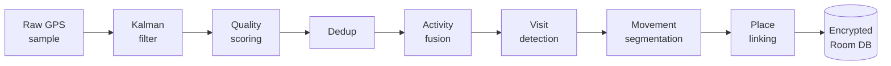
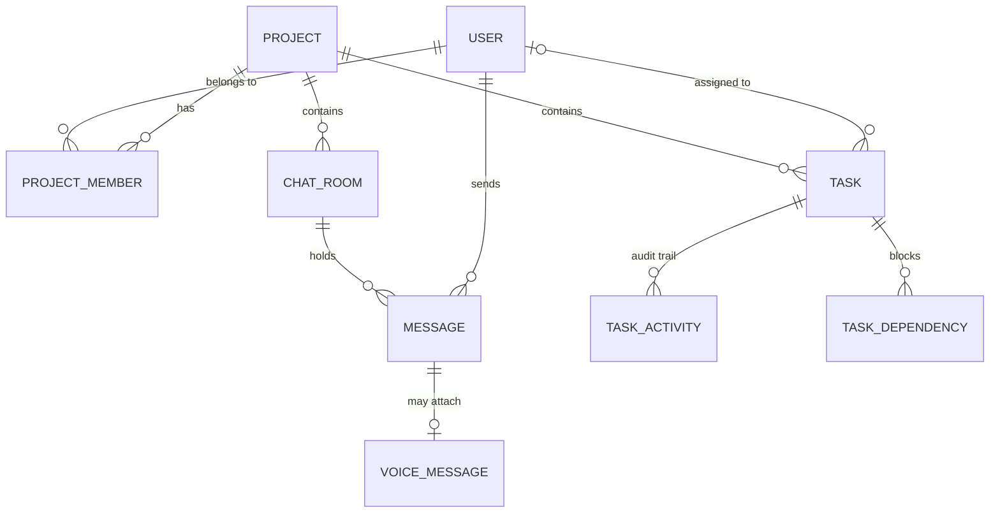
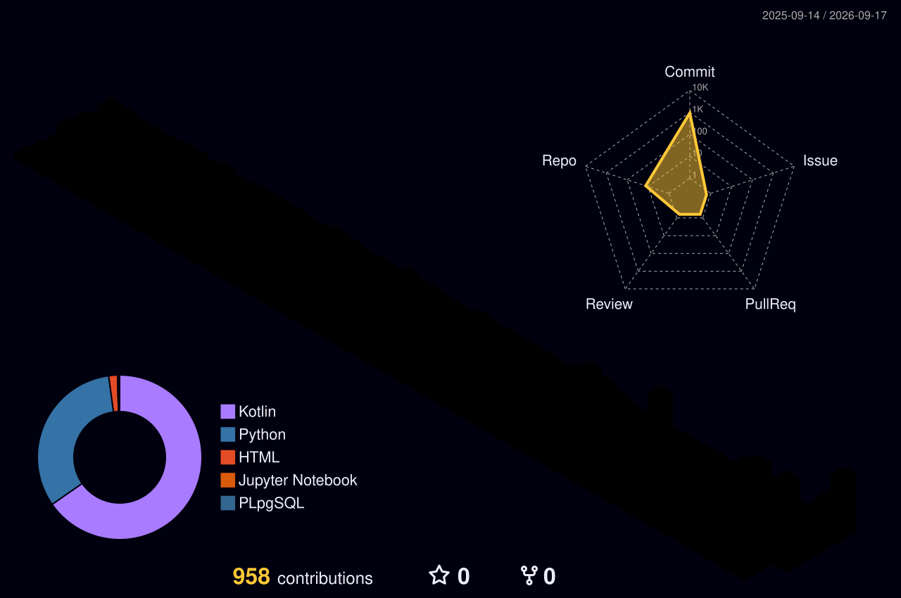

  

I build Android apps that keep working when the network doesn't. Right now that's a journal
with a companion that remembers you and a travel log that rebuilds your day from raw GPS —
both entirely on-device, both with no account to sign up for — plus a team workspace that
does have a backend, because collaboration needs one, and that turned out to be its own kind
of hard.

I like the constraint in both directions. Taking the network away forces you to actually
solve the problem instead of posting it to an endpoint and hoping. Putting it back means you
own every way two people's edits can collide. 

Bhubaneswar, Odisha, India.

---

### What Voyager does to a single GPS point

Eight stages, all on the phone, all in a single-threaded serial channel so the stages can't
race each other. No Google Maps API, no cloud, nothing leaves the device. The GPS duty cycle
adapts to what you're doing — 90 seconds when you're still, 12 walking, 7 driving — and shuts
off entirely after four and a half minutes stationary, waking on the motion sensor.

---

## Things I've built

### 🔥 [Axiom](https://okayanshul.github.io/axiom-site/) · a journal that remembers you

The home screen is a conversation, not a blank page. Say what happened; it digests the session
into a journal entry written in your own voice. It notices what keeps coming up, and if you
mention an interview on Tuesday it asks how it went on Wednesday — once.

Everything it remembers is visible, editable and deletable line by line, with provenance on
every item. ~32,000 lines of Kotlin, Room v12 with **five hand-written migrations and tests for
each** — an app update should never cost you your journal.

[Site](https://okayanshul.github.io/axiom-site/) · [Repo](https://github.com/OkayAnshul/Axiom) · [Privacy policy](https://okayanshul.github.io/axiom-site/privacy.html)

### 🛰️ [Voyager](https://okayanshul.github.io/voyager-site/) · where you went, worked out on your phone

The eight-stage pipeline above, turned into a timeline you can actually read: where you were,
how long you stayed, how you got between places. SQLCipher on the database from the first
commit. OpenStreetMap instead of a paid Maps key, so there's no API bill and no third party
watching.

[Site](https://okayanshul.github.io/voyager-site/) · [Repo](https://github.com/OkayAnshul/Voyager)

### 🌌 [Kosmos](https://okayanshul.github.io/kosmos-architecture/) · project workspaces that survive a tunnel

Tasks, chat and membership scoped to a project, offline-first: every write lands in Room
before it touches the network, and a queue with exponential backoff reconciles it once the
connection's back. Two people editing the same task while both are offline don't just get
last-write-wins — field-level conflict resolution auto-merges disjoint changes and only
interrupts you when two edits actually collide on the same field.

It's the one app here with a real backend, on purpose — 84.5k lines of Kotlin, 16 Room
entities across 12 migrations, Postgres/Supabase with Row-Level Security and realtime over
WebSockets, 26 permissions across 3 roles enforced client-side and again at the database so
a rebuilt client can't cheat the UI-hidden checks. 112 tests, three-job CI. The deep-dive
site has the schema and the annotated code for all of it.

[Site](https://okayanshul.github.io/kosmos-architecture/) · [Repo](https://github.com/OkayAnshul/Kosmos)

---

<b>How Axiom's companion actually works</b> — the part I'd want to read

 

**The digest pipeline.** A conversation isn't a journal entry, so something has to turn one
into the other. When a session ends, the transcript goes through a digester that writes an
entry in the user's own register rather than a summary in the model's. Getting this wrong is
obvious immediately — the entry reads like a customer service email.

**The memory store.** Facts, people, goals, preferences and open loops get extracted into a
store the user can read. Every item carries provenance: *noticed 8 Jun · came up 7× · from a
journal entry*. That transparency isn't decoration — a companion that claims to remember you
but can't show its working is just a chatbot with extra steps.

**Provider abstraction.** Groq and Gemini sit behind one interface, routed per call, with model
selection per task — the cheap fast model for classification, the better one for prose. AI is
opt-in and runs on *your* API key; with no key present, nothing leaves the phone at all.

**Keys at rest.** `EncryptedSharedPreferences` behind an Android Keystore master key. The
threat model isn't sophisticated attackers, it's a stolen unlocked phone and a backup that
sweeps up plaintext.

**On-device work.** Mood classification, pattern detection (which weekday is consistently
hardest, whether this week reads lighter than last, which people correlate with better days)
and semantic search all run locally. FTS4 with the `unicode61` tokenizer for full-text.

**Type-safe navigation.** `@Serializable` destinations, no string routes, no
`savedStateHandle.get<Long>("id")` and no runtime surprise when an argument name drifts.

More on all of this at [the Axiom site](https://okayanshul.github.io/axiom-site/).

<b>What Kosmos looks like underneath</b> — schema, sync, and the migration that bit me

 

The shape of it, trimmed to the entities that carry the app — there are sixteen in total,
across twelve migrations:

**The write path.** Every write hits Room first and returns; the network call is best-effort
after the fact. When it fails, the operation lands in a queue with exponential backoff —
`min(60s, 2^retryCount)`, five attempts — that drains when connectivity comes back. The
subtlety is that a retry can't replay the payload it captured at enqueue time: if a task sat
offline for an hour and got edited twice more locally, that stale JSON would clobber the newer
edits. Updates re-read current state from Room immediately before sending.

**Field-level conflict resolution.** Row-level last-write-wins throws away real work — one
person changes the status, another changes the description, and whoever's write lands second
silently wins the whole row. So resolution happens per field across the nine that matter. Two
edits that don't overlap auto-merge with no prompt. Only a genuine collision on the same field,
inside a five-second window, is worth interrupting someone for.

**The migration that bit me.** Room's `OnConflictStrategy.REPLACE` is a DELETE followed by an
INSERT, which means every `CASCADE` foreign key fires on a routine sync upsert. Rows were
disappearing on writes that looked like plain updates. The fix was migration 9→10: recreate six
tables with `NO_ACTION` instead — SQLite can't drop a constraint, so it's build-new, copy,
drop, rename, six times over. Audit tables lost their actor foreign key entirely; a log of what
happened shouldn't fail to insert because the user who did it isn't cached locally yet.

**Permissions, enforced twice.** Twenty-six of them across three roles. A `PermissionGated`
composable hides what you can't do, which is a UI nicety and nothing more — the real gate is
Row-Level Security in Postgres, so a rebuilt client that skips the composable still can't write
rows it doesn't own. Cross-user writes that are genuinely legitimate, like inserting a
notification for someone else, go through a narrow `SECURITY DEFINER` function rather than
loosening the policy for everyone.

**Realtime.** Three separate `ConcurrentHashMap` channel pools over Supabase Realtime, keyed per
resource, for messages, tasks and membership. They're separate because they were briefly not:
typing indicators and messages shared a map key, the duplicate-guard quietly won, and typing
events never fired at all. Channel keys need a namespace per subscription type, not just per
resource id.

Schema, diagrams and annotated code at [the Kosmos site](https://okayanshul.github.io/kosmos-architecture/).

<b>What I keep coming back to</b>

 

**Local-first, because it's harder.** Anyone can call an API. Doing sentiment analysis, semantic
search and pattern detection on a mid-range phone with no network means confronting how much of
"AI" is a round-trip you didn't need. Most of it, it turns out.

**Schema evolution as a discipline.** Room's destructive fallback is a footgun aimed at your
users' data. Writing migrations by hand and testing each one is tedious in exactly the way that
matters — it's the difference between an app you can update and an app you can only reinstall.

**Privacy as a design constraint, not a marketing line.** "No server" removes the option to fix
things later with a backfill script. Every decision has to be right on the device, on the first
try, for a user you'll never be able to contact. That pressure makes the engineering better.

**Writing things down.** The engineering write-up for Axiom is longer than some of the code it
describes, and I'd defend that. If I can't explain why a decision was made, I probably borrowed
it rather than made it.

Currently getting deeper into on-device inference, and reading a lot about how far you can push
a phone before it's genuinely too small for the problem.

---

### What I've been committing lately

<!--RECENT_COMMITS:START-->
- **[OkayAnshul](https://github.com/OkayAnshul/OkayAnshul/commit/52bd8908d2f74dd19e0c25e640e795a84bb40720)** — Remove header formatting from README.md _· 5 days ago_
- **[OkayAnshul](https://github.com/OkayAnshul/OkayAnshul/commit/3e72960c0f08602e26168dc6ba4bce294a9abad2)** — Refactor README content with headings _· 5 days ago_
- **[OkayAnshul](https://github.com/OkayAnshul/OkayAnshul/commit/1297daaf102369b5d8e0e526cef7594f6f90aae5)** — Give Kosmos the same depth Axiom and Voyager already had _· 5 days ago_
- **[OkayAnshul](https://github.com/OkayAnshul/OkayAnshul/commit/6070c52f4a97795394c9a9a7402440063761274d)** — Bring Kosmos up to par with Axiom and Voyager's write-ups _· 5 days ago_
- **[Kosmos](https://github.com/OkayAnshul/Kosmos/commit/cae1990d9b6249b3525db1a3e62655505d1b8ce3)** — docs: sharpen README for recruiter/Android-dev audience, drop interview prep link _· 5 days ago_
<!--RECENT_COMMITS:END-->

---

### Contributions

<picture>
  <source media="(prefers-color-scheme: dark)" srcset="https://raw.githubusercontent.com/OkayAnshul/OkayAnshul/output/github-snake-dark.svg" />
  <source media="(prefers-color-scheme: light)" srcset="https://raw.githubusercontent.com/OkayAnshul/OkayAnshul/output/github-snake.svg" />
  
</picture>

<picture>
  <source media="(prefers-color-scheme: dark)" srcset="./profile-3d-contrib/profile-night-rainbow.svg" />
  <source media="(prefers-color-scheme: light)" srcset="./profile-3d-contrib/profile-green-animate.svg" />
  
</picture>

Both of the above are generated by Actions in this repo and committed here — nothing depends
on a third party's free tier staying free.

---

### Stack

Kotlin, almost exclusively — it's 100% of both Axiom and Voyager by GitHub's own count. Jetpack
Compose with Material 3, Hilt, Room, WorkManager, DataStore, Glance for widgets, Ktor and
kotlinx.serialization. R8 with hand-written keep rules. Where there is a backend it's Postgres
on Supabase — schema, row-level security policies and realtime channels written by hand, not
generated. Enough Python to be dangerous in a Jupyter notebook.

### Elsewhere

[LinkedIn](https://www.linkedin.com/in/builderanshul) ·
[X](https://x.com/ern404errFate) ·
[anshulisokay@gmail.com](mailto:anshulisokay@gmail.com) ·
[Axiom](https://okayanshul.github.io/axiom-site/) ·
[Voyager](https://okayanshul.github.io/voyager-site/)
