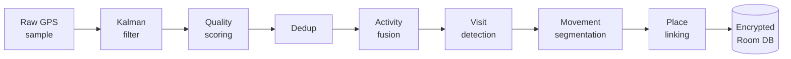

  

I build Android apps that work without a server. Right now that's a journal with a companion
that remembers you, and a travel log that rebuilds your day from raw GPS — both entirely
on-device, both with no account to sign up for.

I like the constraint. Taking the network away forces you to actually solve the problem
instead of posting it to an endpoint and hoping.

Bhubaneswar, Odisha, India.

---

### What Voyager does to a single GPS point

Eight stages, all on the phone, all in a single-threaded serial channel so the stages can't
race each other. No Google Maps API, no cloud, nothing leaves the device. The GPS duty cycle
adapts to what you're doing — 90 seconds when you're still, 12 walking, 7 driving — and shuts
off entirely after four and a half minutes stationary, waking on the motion sensor.

---

## Things I've built

### 🔥 [Axiom](https://okayanshul.github.io/axiom-site/) · a journal that remembers you

The home screen is a conversation, not a blank page. Say what happened; it digests the session
into a journal entry written in your own voice. It notices what keeps coming up, and if you
mention an interview on Tuesday it asks how it went on Wednesday — once.

Everything it remembers is visible, editable and deletable line by line, with provenance on
every item. ~32,000 lines of Kotlin, Room v12 with **five hand-written migrations and tests for
each** — an app update should never cost you your journal.

[Site](https://okayanshul.github.io/axiom-site/) · [Repo](https://github.com/OkayAnshul/Axiom) · [Privacy policy](https://okayanshul.github.io/axiom-site/privacy.html)

### 🛰️ [Voyager](https://okayanshul.github.io/voyager-site/) · where you went, worked out on your phone

The eight-stage pipeline above, turned into a timeline you can actually read: where you were,
how long you stayed, how you got between places. SQLCipher on the database from the first
commit. OpenStreetMap instead of a paid Maps key, so there's no API bill and no third party
watching.

[Site](https://okayanshul.github.io/voyager-site/) · [Repo](https://github.com/OkayAnshul/Voyager)

### 🌌 [Kosmos](https://github.com/OkayAnshul/Kosmos) · project workspaces that survive a tunnel

Tasks, members and chat scoped to a project, in one offline-first Android app. Room-backed
local state with sync and retry, so the app keeps working when the connection doesn't.

[Repo](https://github.com/OkayAnshul/Kosmos)

---

<b>How Axiom's companion actually works</b> — the part I'd want to read

 

**The digest pipeline.** A conversation isn't a journal entry, so something has to turn one
into the other. When a session ends, the transcript goes through a digester that writes an
entry in the user's own register rather than a summary in the model's. Getting this wrong is
obvious immediately — the entry reads like a customer service email.

**The memory store.** Facts, people, goals, preferences and open loops get extracted into a
store the user can read. Every item carries provenance: *noticed 8 Jun · came up 7× · from a
journal entry*. That transparency isn't decoration — a companion that claims to remember you
but can't show its working is just a chatbot with extra steps.

**Provider abstraction.** Groq and Gemini sit behind one interface, routed per call, with model
selection per task — the cheap fast model for classification, the better one for prose. AI is
opt-in and runs on *your* API key; with no key present, nothing leaves the phone at all.

**Keys at rest.** `EncryptedSharedPreferences` behind an Android Keystore master key. The
threat model isn't sophisticated attackers, it's a stolen unlocked phone and a backup that
sweeps up plaintext.

**On-device work.** Mood classification, pattern detection (which weekday is consistently
hardest, whether this week reads lighter than last, which people correlate with better days)
and semantic search all run locally. FTS4 with the `unicode61` tokenizer for full-text.

**Type-safe navigation.** `@Serializable` destinations, no string routes, no
`savedStateHandle.get<Long>("id")` and no runtime surprise when an argument name drifts.

More on all of this at [the Axiom site](https://okayanshul.github.io/axiom-site/).

<b>What I keep coming back to</b>

 

**Local-first, because it's harder.** Anyone can call an API. Doing sentiment analysis, semantic
search and pattern detection on a mid-range phone with no network means confronting how much of
"AI" is a round-trip you didn't need. Most of it, it turns out.

**Schema evolution as a discipline.** Room's destructive fallback is a footgun aimed at your
users' data. Writing migrations by hand and testing each one is tedious in exactly the way that
matters — it's the difference between an app you can update and an app you can only reinstall.

**Privacy as a design constraint, not a marketing line.** "No server" removes the option to fix
things later with a backfill script. Every decision has to be right on the device, on the first
try, for a user you'll never be able to contact. That pressure makes the engineering better.

**Writing things down.** The engineering write-up for Axiom is longer than some of the code it
describes, and I'd defend that. If I can't explain why a decision was made, I probably borrowed
it rather than made it.

Currently getting deeper into on-device inference, and reading a lot about how far you can push
a phone before it's genuinely too small for the problem.

---

### What I've been committing lately

<!--RECENT_COMMITS:START-->
- **[axiom-site](https://github.com/OkayAnshul/axiom-site/commit/98fb4a6c797dbb940920cf856deff34bbd87f60d)** — Screenshot grid: 2 / 3 / 4 columns instead of auto-fill _· today_
- **[axiom-site](https://github.com/OkayAnshul/axiom-site/commit/95ace10daa66512fe5fe86f29376a9145a247cd6)** — Screenshots wrap in a grid instead of a horizontal scroller _· today_
- **[axiom-site](https://github.com/OkayAnshul/axiom-site/commit/736e86ace2eb0ddc9081ad7c1c3e52363d9dd8b0)** — Axiom showcase site: landing page, privacy policy, screenshots _· today_
- **[voyager-site](https://github.com/OkayAnshul/voyager-site/commit/da783f0bf58b8034c6cadf0ccef92c281a145c58)** — Deepen site content (conceptual): engineering, features, dev-story, landing _· 7 days ago_
- **[voyager-site](https://github.com/OkayAnshul/voyager-site/commit/a8b4ca193f9a8cd6f9eeabe8155aa1150079cafa)** — Add engineering deep-dive page + architecture diagram; Engineering nav link _· 8 days ago_
<!--RECENT_COMMITS:END-->

---

### Stack

Kotlin, almost exclusively — it's 100% of both Axiom and Voyager by GitHub's own count. Jetpack
Compose with Material 3, Hilt, Room, WorkManager, DataStore, Glance for widgets, Ktor and
kotlinx.serialization. R8 with hand-written keep rules. Enough Python to be dangerous in a
Jupyter notebook.

### Elsewhere

[LinkedIn](https://www.linkedin.com/in/builderanshul) ·
[X](https://x.com/ern404errFate) ·
[anshulisokay@gmail.com](mailto:anshulisokay@gmail.com) ·
[Axiom](https://okayanshul.github.io/axiom-site/) ·
[Voyager](https://okayanshul.github.io/voyager-site/)
